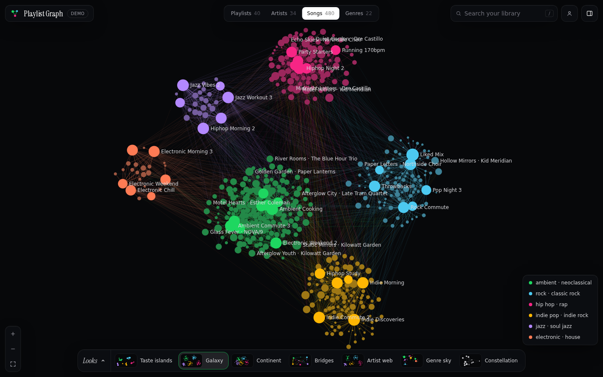
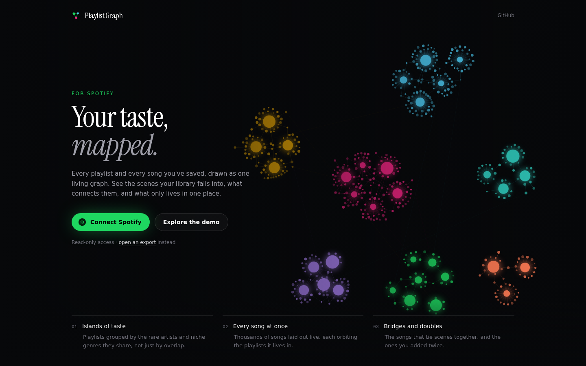
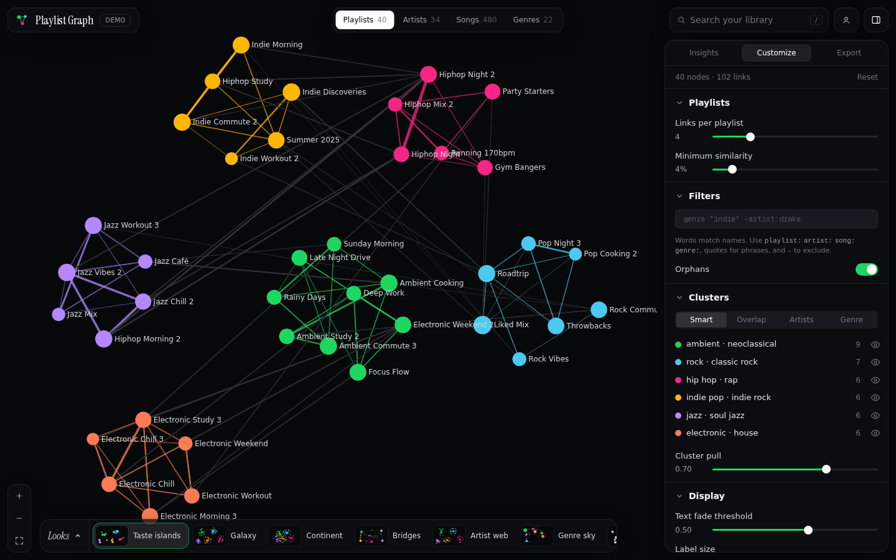
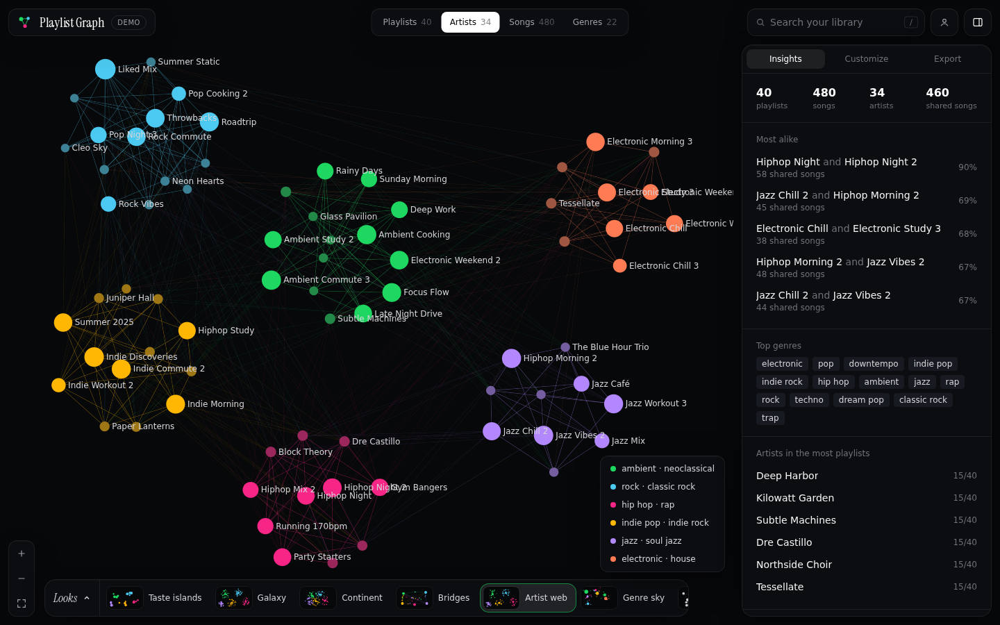
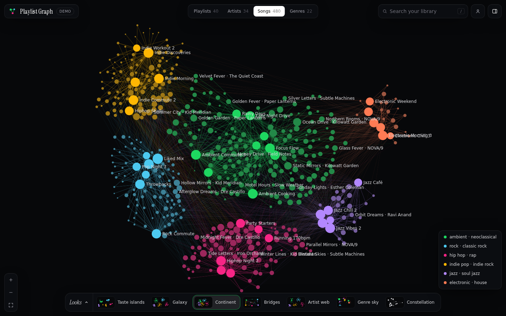

# Playlist Graph

[](https://spotify-playlist-graph.vercel.app)

See how your Spotify playlists connect: which ones overlap, which artists and
songs tie them together, and where you've added the same song twice.

Live: [spotify-playlist-graph.vercel.app](https://spotify-playlist-graph.vercel.app) ·
no Spotify account needed for the demo (`/?demo`).



## Features

- **Every song at once**: the Songs view shows your whole library by default,
  thousands of nodes laid out live in a web worker so the page stays responsive.
- **Looks**: one-click starting points that set view, clustering, forces and
  display together: Taste islands, Galaxy, Continent, Bridges, Artist web,
  Genre sky and Constellation.
- **Islands that hold up at scale**: clusters get their own packed area sized
  to how many nodes they have, links between clusters give way as cluster pull
  rises, and repulsion only acts locally, so the same settings look the same
  for 50 nodes or 5,000.
- **Playlist, Artist, Song and Genre views**, switched from the top bar, with
  smart (taste), overlap, artist or genre clusters.
- **Insights panel**: closest playlists with the exact songs they share, top
  artists, how much of a playlist is unique, duplicates and alternate versions.
- **Search** across playlists, artists and songs (press <kbd>/</kbd>), and
  Obsidian-style filters (`genre:"indie" -artist:drake`).
- **Export** as PNG, CSV (zip) or JSON; open a JSON export again without Spotify,
  straight from the landing page.
- **Fast reloads**: playlists are cached in IndexedDB and only re-fetched when
  Spotify reports a change (snapshot id).
- **Demo mode** with generated data.

| | |
|---|---|
|  |  |
|  |  |

## How it works

- Spotify login uses the authorization code flow. Tokens live in httpOnly
  cookies and are refreshed automatically on the server.
- Scopes: `playlist-read-private playlist-read-collaborative` (read-only).
- Uses the post-February-2026 Web API (`/playlists/{id}/items`). Spotify only
  lets Development Mode apps read playlists the user owns or collaborates on,
  and no longer returns artist genres. Genres are looked up from Last.fm tags
  when `LASTFM_API_KEY` is set (free key at https://www.last.fm/api/account/create,
  fast), otherwise from MusicBrainz (no key, about one artist per second).
  Results are cached in the browser for 30 days.
- Graph rendering: [sigma.js](https://www.sigmajs.org/) (WebGL) + graphology
  (Louvain clustering). The layout is d3-force running in a web worker
  (`lib/layout.worker.ts`), with the scale-aware forces in `lib/forces.ts`.

## Development

1. Create an app in the [Spotify Developer Dashboard](https://developer.spotify.com/dashboard)
   and add the redirect URI `http://127.0.0.1:3000/api/auth/callback`
   (Spotify doesn't accept `localhost`). In Development Mode, add every
   account that should be able to log in under **User Management**.
2. Create `.env.local`:

   ```env
   SPOTIFY_CLIENT_ID=your_client_id
   SPOTIFY_CLIENT_SECRET=your_client_secret
   BASE_URL=http://127.0.0.1:3000
   # optional, makes genre lookup much faster
   LASTFM_API_KEY=your_lastfm_key
   ```

3. Run it:

   ```bash
   pnpm install
   pnpm dev
   ```

   Open http://127.0.0.1:3000.

## Deployment (Vercel)

Set the same three environment variables in the Vercel project, with
`BASE_URL` set to the production URL (e.g. `https://spotify-playlist-graph.vercel.app`),
and register `${BASE_URL}/api/auth/callback` as a redirect URI in the Spotify
dashboard. If `BASE_URL` is unset, the request origin is used.
